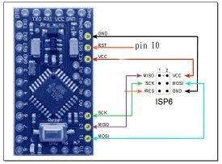
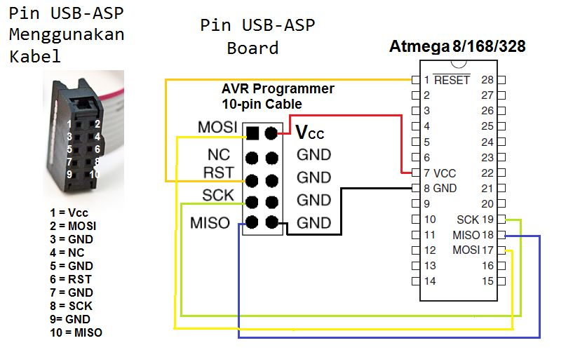

# Atmega 328p Project with a USB ASP
This boilerplate repo is designed for projects using the USB-ASP programmer and the command line interface on a debian system.

It is based around a tutorial by [Lukasz Cepowski](http://cepa.io/devlog/avr-gcc-hello-world-with-atmega328p).

## General Procedure:
### 0. Required Packages and Utilities
The `avr-gcc` compiler:

`$ sudo apt-get install gcc-avr`

The `avrdude` hex loading utility:

`$ sudo apt-get install avrdude`

### 1. create sources
`$ emacs main.c`

### 2. compile
i.e.:

`$ avr-gcc -Wall -Os -DF_CPU=16000000 -mmcu=atmega328p -c main.c -o main.o`

`$ avr-gcc -Wall -mmcu=atmega328p -o main.elf main.o`

`$ avr-objcopy -j .text -j .data -O ihex main.elf main.hex`

### 3. ping programmer and clear flash
`$ avrdude -c usbasp -p m328p`

`$ avrdude -c usbasp -p m328p -e`

### 4. burn
(aka deploy) i.e.:

`$ avrdude -c usbasp -p m328p -U flash:w:main.hex:i`

## Using the Boilerplate
0. Clone the directory.
1. Bring in any additional sources.
2. Write your application.
3. `$ make && make burn`
4. Test/observe your application

## Interfacing your USB ASP Dongle
### Connections
The pinout on the USB ASP connector is fairly well-defined, but here is a reference to make things slightly easier _(stolen from google image sources)_:

### Troubleshooting
___Always ensure that you are using an external power source!___
The `USBASP` dongles can provide power to your target hardware _during programming_, however if you are working in a feedback loop of `write code, compile, burn, test` you need to be powering your hardware as if you were deploying it. 